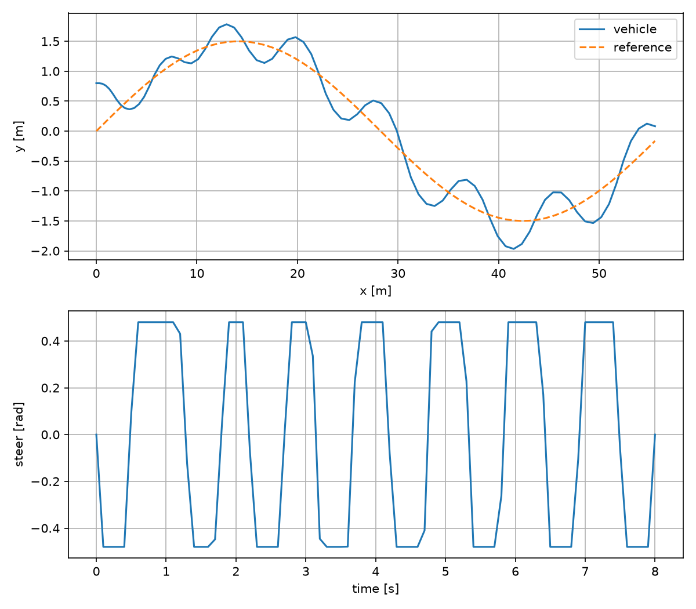

# Vehicle Path Tracking MPC

A constrained path-tracking benchmark for a kinematic bicycle model. Pure Pursuit and gain-scheduled lateral feedback are compared with warm-started nonlinear MPC across curvature, reduced steering authority, and command latency.



| Nominal MPC result | Value |
|---|---:|
| Lateral RMSE | 0.3220 m |
| Constraint violations | 0 |
| Median solve time | 12.6 ms |
| p99 solve time | 21.7 ms |

## Quick start

```bash
python -m venv .venv && source .venv/bin/activate
pip install -e ".[dev]"
python -m vehicle_mpc.simulate --config configs/nominal.yaml
python -m vehicle_mpc.benchmark --suite standard
pytest
```

## Original contributions

- One plant and metrics contract shared by three controller families.
- Constrained receding-horizon optimization with warm starts and timing telemetry.
- Deterministic low-friction and 200ms latency scenarios.
- Machine-readable constraint, tracking, and solver-latency results.

The portable CI backend uses SciPy L-BFGS-B. `docs/solver-backends.md` defines the same state, input, cost, and constraint contract for an optional acados deployment backend without vendoring acados.

## Acceptance targets

The standard track targets lateral RMSE below 0.35m, zero lane/input constraint violations, and median MPC solve time below 20ms on the documented test machine. Generated benchmark data is the source of truth.

## Limitations

The kinematic plant is inappropriate near the tire friction limit and omits roll, pitch, tire slip, and actuator dynamics. Reported wall-clock time is a software benchmark, not a hard real-time guarantee.
